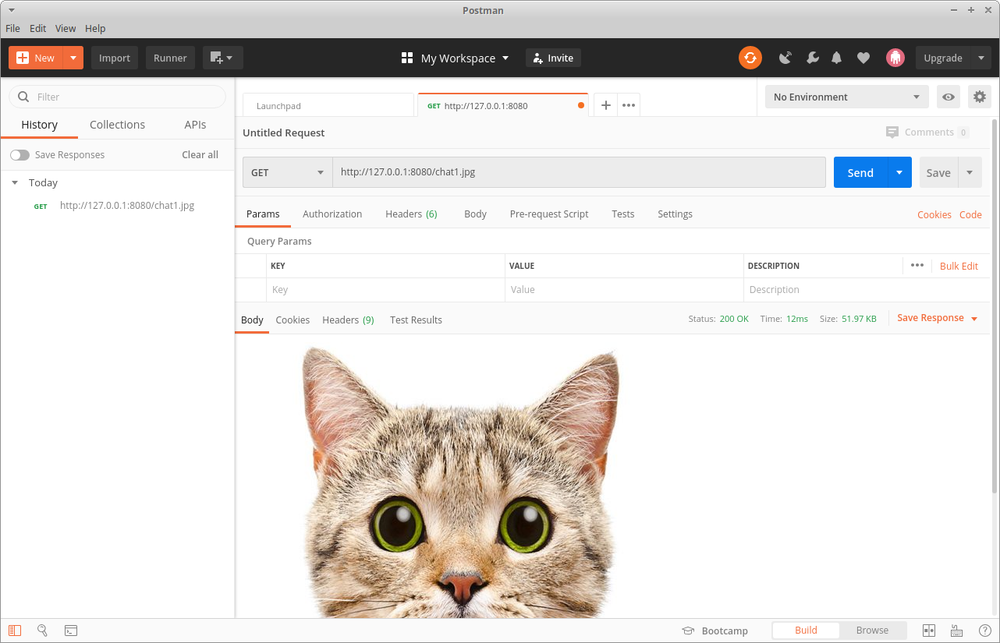
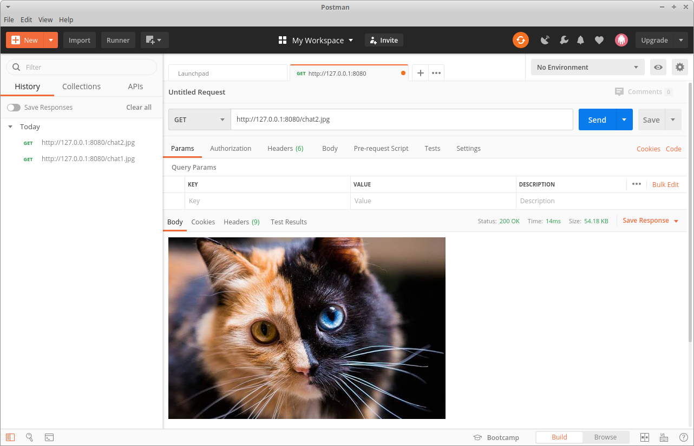

# Prise en main du framework express

### Code source :
#### script.js
```javascript
cconst express = require('express');
const app = express();
const path = require('path');

const port = 8080;

app.use(express.static(path.join(__dirname, 'public')));
app.listen(port, () => console.log(`App listening on port ${port}.`));

app.get('/', (req, res) => res.send("\
    <li>\
        <a href=\"test.txt\">test ici</a>\
    </li>\
    <li>\
        <a href=\"chat1.jpg\">chat 1</a>\
    </li>\
    <li>\
        <a href=\"chat2.jpg\">chat 2</a>\
    </li>"
));
```

### Run time :
```
node script.js
```

### Résultat : 

* Avec : `127.0.0.1:8080/chat1.jpg`
    * 
* Avec : `127.0.0.1:8080/chat2.jpg`
    * 
