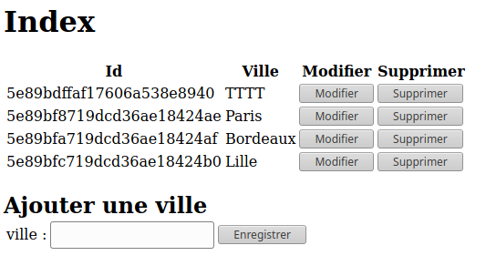
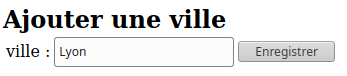
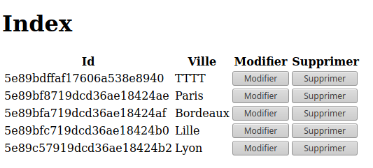
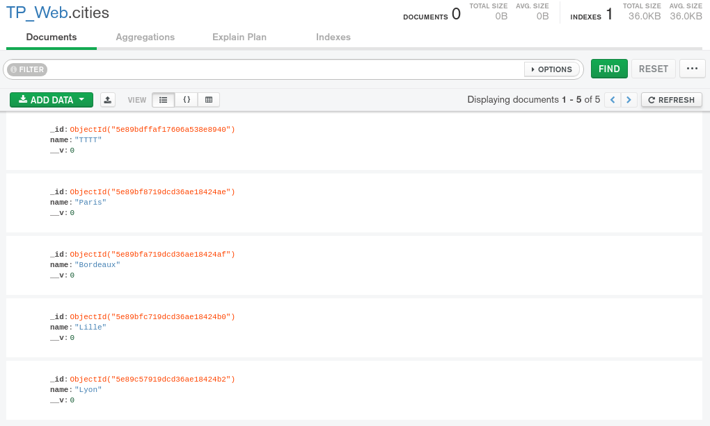
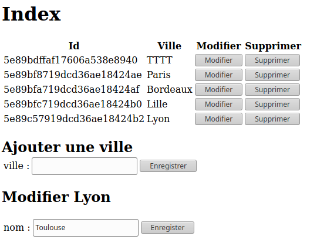
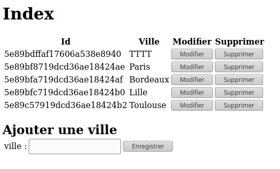
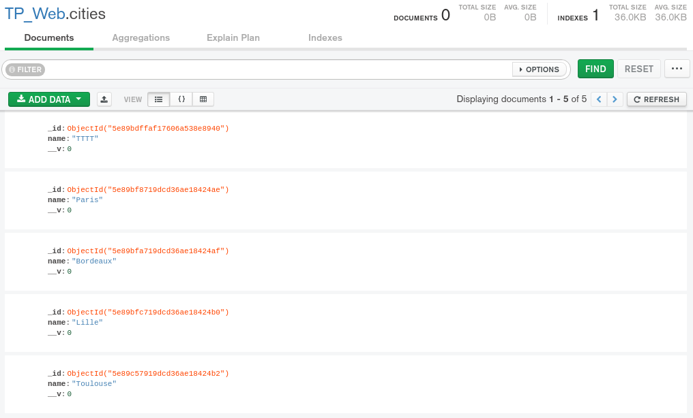
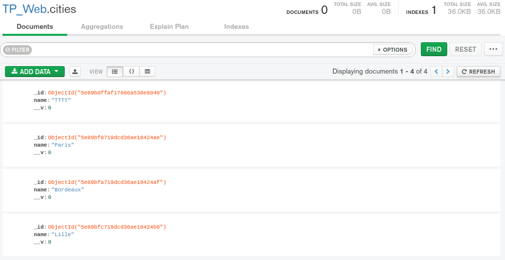

# TP Mongo BD

## Sommaire :

* [Code source](#Code-source)
* [Résultat](#Resultat)

***
## Code source

### Index.pug
```pug
html
  body
    h1=titre
    a(href='/cities') Cities
```

### Template.pug
```pug
html
  body
    script.
      function editCity(eid,name){
        document.getElementById("editTitle").textContent = "Modifier " + name;
        document.getElementById("editBtn").innerHTML = '<button onClick="formatAndfakeSubmit(\''+eid+'\')" >Enregister</button>';
        document.getElementById("editBox").style.display = "";
      }

      function formatAndfakeSubmit(eid){
        var data={};
        data.name = document.getElementById("newName").value;
        
        var json = JSON.stringify(data);
        var XMLHTTP = new XMLHttpRequest();
        XMLHTTP.open('PUT','/city/'+eid, true);
        
        XMLHTTP.setRequestHeader('Content-type', 'application/json', charset='utf-8');
        XMLHTTP.send(json);
        document.getElementById("editBox").style.display = "none";
        XMLHTTP.onLoad = function() {
          document.location.href="./cities";
        }
      }

      function formatAndSubmit(){
        var data={};
        data.name = document.getElementById("newCityName").value;
        
        var json = JSON.stringify(data);
        var XMLHTTP = new XMLHttpRequest();
        XMLHTTP.open('POST','/city', true);
        
        XMLHTTP.setRequestHeader('Content-type', 'application/json', charset='utf-8');
        XMLHTTP.send(json);
        XMLHTTP.onLoad = function() {
          document.location.href="./cities";
        }
      }

      function deleteCity(eid){
        var XMLHTTP = new XMLHttpRequest();
        XMLHTTP.open('DELETE','/city/'+eid, true);
        
        XMLHTTP.setRequestHeader('Content-type', 'application/json', charset='utf-8');
        XMLHTTP.send();
        XMLHTTP.onLoad = function() {
          //
        }
        //document.location.href="./cities";
      }

    h1=titre
    table
      tr
        th Id
        th Ville
        th Modifier
        th Supprimer
      each element in bddContent
        tr
          td=element._id
          td=element.name
          td
            button(onclick="editCity('"+ element._id +"','"+ element.name +"')") Modifier
          td
            button(onclick="deleteCity('"+ element._id +"')") Supprimer
  div
    h2 Ajouter une ville
      table
        tr
          td
            Nom ville :
          td 
            input(type="text", name="name", id="newCityName")
          td 
            button(onclick="formatAndSubmit()") Enregistrer
  div(id="editBox", style="display:none")
    h2(id="editTitle") Modifier
    table
      tr
        td
          Nouveau nom :
        td 
          input(type="text", id="newName")
        td(id="editBtn") 
          button(onclick="formatAndfakeSubmit()") Enregistrer
```

### Script.js
```js
const express = require('express');
const app = express();
const path = require('path');
const bodyParser = require('body-parser');
const mongoose = require('mongoose');

const port = 8080;

var renderArgs = {
    titre: '',
    bddContent: []
};

const db = mongoose.connection;

app.set("view engine", "pug");
app.use(express.static(path.join(__dirname, 'public')));
app.use(bodyParser.json());

app.listen(port, () => console.log(`App listening on port ${port}.`));

mongoose.connect("mongodb://localhost/TP_Web", { useNewUrlParser: true });
const citySchema = new mongoose.Schema({
    name: String
});

const City = mongoose.model("cities", citySchema);
db.on("error", console.error.bind(console, "connection error"));
db.once("open", function(){
    //
})

app.get('/', (req, res) => {
    renderArgs.titre = "Index"
    res.render('index', renderArgs);
});

app.get('/cities', (req, res) => {
    City.find((err, cities) => {
        if(err) {
            console.error(err);
        } else {
            renderArgs.bddContent = JSON.parse(JSON.stringify(cities));
            res.render('template', renderArgs);
        }
    });
});

app.post('/city', bodyParser.json(), (req, res) => {
    console.log(req.body.name);
    if(req.body.name !== undefined && req.body.name !== null){
        City.findOne({name:req.body.name}, (err, city) => {
            if(err) {
                return console.error(err);
            }
            if(city == null){
                const addCity = new City({name: req.body.name});
                addCity.save((err) =>{
                    if(err){
                        return console.error(err);
                    }
                    City.find((err, cities) => {
                        if(err) {
                            console.error(err);
                        } else {
                            renderArgs.bddContent = JSON.parse(JSON.stringify(cities));
                            res.render('template', renderArgs); // Un formulaire ACTION pointe sur cette page
                        }
                    });
                });
            }
        })
    } else { res.render('template', renderArgs); }
});

app.put('/city/:id', (req,res) => {
    var id = null;
    if(req.params && req.params.id){
        id = req.params.id;
    }
    if(id == null){
        console.log("ID not found");
        res.setHeader('Content-type', 'text/html');
        res.statusCode = 400;
        res.end(); 
    } else {
        if(req.body.name != undefined && req.body.name != null) {
            City.findOneAndUpdate({_id: id}, req.body, (err) => {
                if(err){
                   return console.error(err); 
                }
                City.find((err, cities) => {
                    if(err) {
                        console.error(err);
                    } else {
                        renderArgs.bddContent = JSON.parse(JSON.stringify(cities));
                        res.render('template', renderArgs);
                    }
                });
            });
        }
    }
});

app.delete('/city/:id', (req,res) => {
    var id = null;
    if(req.params && req.params.id){
        id = req.params.id;
    } 
    if(id == null){
        console.log("ID not found");
        res.setHeader('Content-type', 'text/html');
        res.statusCode = 400;
        res.end(); 
    } else {
        City.deleteOne({_id:id}, (err) => {
            if(err){
                return console.error(err);
            }
            City.find((err, cities) => {
                if(err) {
                    console.error(err);
                } else {
                    renderArgs.bddContent = JSON.parse(JSON.stringify(cities));
                    res.render('template', renderArgs);
                }
            });
        });
    }
});
```
***
## Resultat



### Ajout d'une ville sur le Web:

Ici, on ajoute une ville nommé "Lyon" :  

#### Résulat sur le web


#### Résultat sur MongoDB


### Modification d'une ville sur le Web:

Ici, on renomme une ville nommé "Lyon" en "Toulouse" en cliquant sur le bouton "Modifier", on élement s'affiche sur la page :  

#### Résulat sur le web


#### Résultat sur MongoDB


### Suppression d'une ville sur le Web:

Ici, on supprime "Toulouse" en cliquant sur le bouton Supprimer :
#### Résulat sur MongoDB


